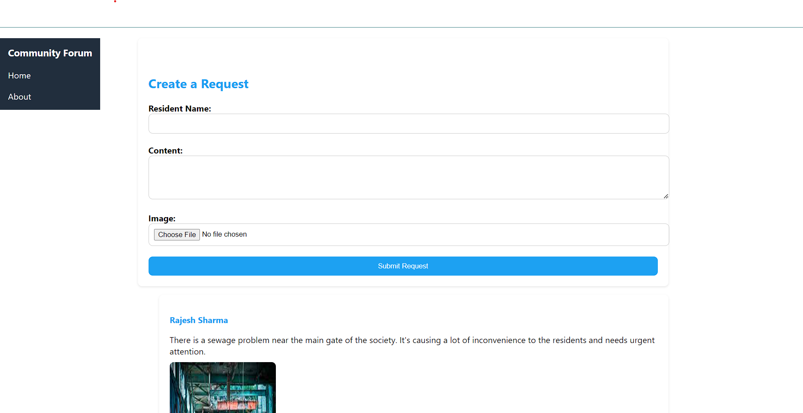
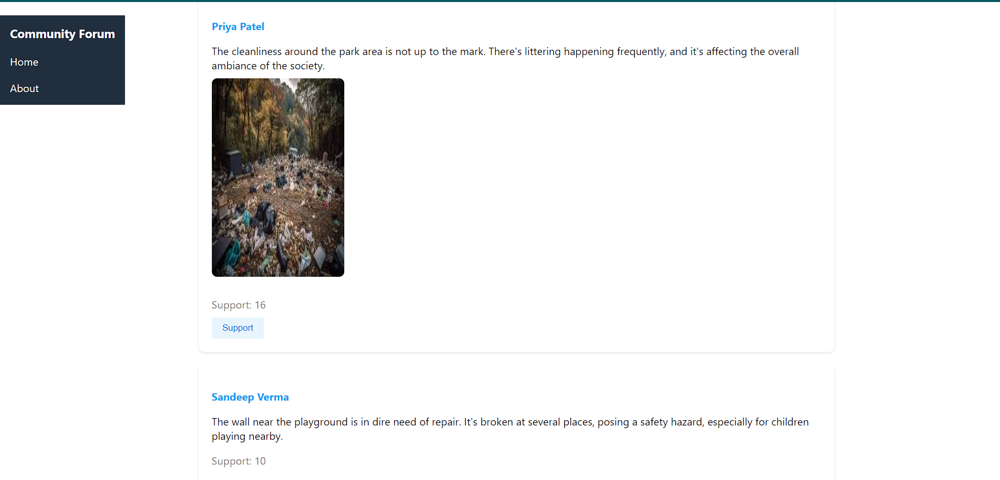

# Community Forum

Welcome to Community Forum, a platform designed to facilitate communication and collaboration within your residential community.

Community Forum is a web-based application that enables residents to raise concerns, share suggestions, and engage in discussions with fellow community members. Whether it's addressing maintenance issues, suggesting improvements, or simply sharing ideas, Community Forum provides a platform for residents to connect and collaborate effectively.

## Features

- **Raise Requests**: Share concerns, suggestions, or feedback with the community by creating requests.
  
- **Support Requests**: Show your support for community initiatives by liking requests raised by others.

- **User-Friendly Interface**: Enjoy a simple and intuitive user interface designed for easy navigation and interaction.

## Getting Started

1. **Explore Requests**: Once logged in, you'll be directed to the main page where you can explore existing requests raised by fellow community members.

2. **Create a Request**: Have a concern or suggestion? Click on the "Create a Request" button to share your thoughts with the community. Fill in your name, describe your request, and optionally upload an image related to your request.

3. **Support Others**: Show your support for requests by liking them. The number of likes each request receives is displayed, helping prioritize community concerns based on popularity.

## Installation

To run the Community Forum locally on your machine, follow these steps:

1. Clone the repository: `git clone https://github.com/602dhruviii/Community-Form-Mern.git`
2. Install dependencies: `npm install`
3. Start the development server: `npm start and node server.js`

## Technologies Used

- Frontend: React.js, React Router, styled-components
- Backend: Node.js, Express.js, MongoDB
- Other: Axios, Multer

## Screenshot
### Create Requests

### View Requests

## Feedback and Support

We're always looking to improve the platform based on your feedback. If you have any suggestions, encounter issues, or need assistance, feel free to reach out to our support team.

## License

This project is licensed under the [MIT License](https://opensource.org/licenses/MIT).
